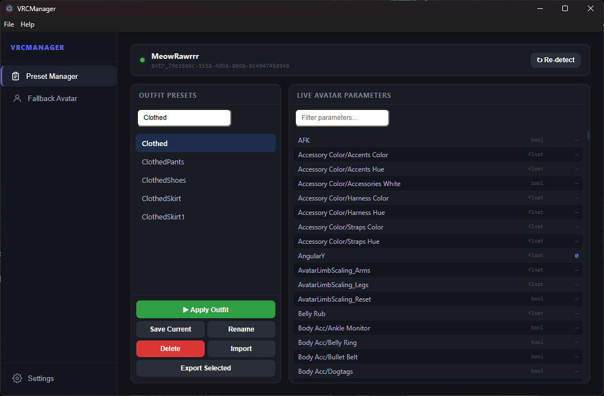
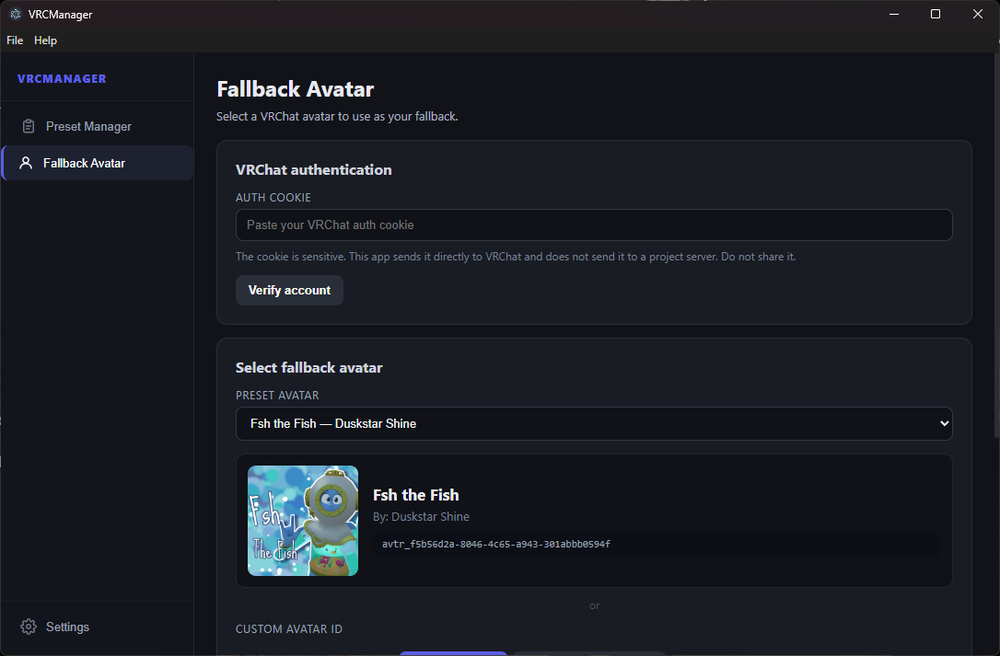

# VRCManager

A simple Windows application for managing your **VRChat avatars**, including fallback avatars and avatar outfit presets.

## Features

### Avatar Preset Manager

* Save your current avatar outfit as a preset
* Apply saved presets to quickly switch outfits
* Rename presets
* Import and export presets for easy backup and sharing
* Switch outfits without navigating through your avatar's menus every time
* View your avatar's OSC parameters and their current values



### Fallback Avatar Manager

* Change your VRChat fallback avatar
* Browse available fallback avatars
* View avatar images
* See avatar names and authors
* Simple interface
* No VRChat password required



## Requirements

* Windows 10/11
* A VRChat account
* Your VRChat `auth` cookie for fallback avatar management

## How to Use

### Avatar Preset Manager

1. Load an avatar in VRChat.
2. Open the **Preset Manager** in VRCManager.
3. Interact with your avatar to populate its parameters.
4. Save your current outfit as a preset.
5. Select a saved preset and click **Apply** to switch outfits.

Presets can also be **renamed, imported, and exported** for easier organization, backup, and sharing.

### Fallback Avatar Manager

1. Download the latest release from the **Releases** page.
2. Run `VRCManager.exe`.
3. Enter your VRChat `auth` cookie.
4. Browse the available fallback avatars.
5. Select the avatar you want.
6. Click **Set Fallback Avatar**.

Your selected avatar will become your VRChat fallback avatar.

---

# Getting Your Auth Cookie

The fallback avatar manager uses your existing VRChat login session. You don't need to enter your VRChat password.

Your authentication cookie is called:

```text
auth
```

**Never share this value with anyone. Treat it like your password.**

### Chrome

1. Open [VRChat](https://vrchat.com/) and log in.
2. Press `F12`.
3. Open **Application**.
4. Go to **Storage → Cookies**.
5. Select `https://vrchat.com`.
6. Find the cookie named `auth`.
7. Copy the **Value**.

### Edge

1. Open [VRChat](https://vrchat.com/) and log in.
2. Press `F12`.
3. Open **Application**.
4. Go to **Storage → Cookies**.
5. Select `https://vrchat.com`.
6. Find `auth`.
7. Copy the **Value**.

### Firefox

1. Open [VRChat](https://vrchat.com/) and log in.
2. Press `F12`.
3. Open **Storage**.
4. Go to **Cookies**.
5. Select `https://vrchat.com`.
6. Find `auth`.
7. Copy the **Value**.

### Brave

Brave uses the same developer tools as Chrome:

1. Open [VRChat](https://vrchat.com/) and log in.
2. Press `F12`.
3. Open **Application**.
4. Go to **Storage → Cookies**.
5. Select `https://vrchat.com`.
6. Find `auth`.
7. Copy the **Value**.

### Other Chromium Browsers

For browsers such as Opera, Vivaldi, and Chromium:

```text
F12
→ Application
→ Storage
→ Cookies
→ vrchat.com
→ auth
→ Value
```

---

# Privacy

**VRCManager does not store, collect, or use your VRChat authentication cookie for any purpose other than making the requested VRChat API request.**

Your cookie is **not uploaded to a server, database, or third-party service** by VRCManager.

The application does not:

* Store your cookie
* Collect your cookie
* Send your cookie to the developer
* Upload your cookie to a database
* Sell or share your cookie
* Use your cookie for any purpose other than authentication with VRChat

The cookie is provided by you and is used only to authenticate requests to VRChat.

**Your authentication cookie is sensitive information. Never share it with anyone.**

---

# Disclaimer

VRCManager is an **independent community project** and is not affiliated with, endorsed by, or sponsored by VRChat Inc.

VRChat and its trademarks belong to their respective owners.

Use this application at your own risk and in accordance with VRChat's Terms of Service.

---

# Credits

* **VRCManager** — created by [Saesei]
* Avatar information and images are provided by VRChat.

---

# License

This project is licensed under the **MIT License**.

See the [`LICENSE`](LICENSE) file for the full license text.
